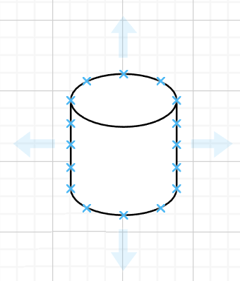
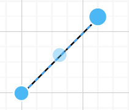

## ECT Lab Introduction - Drawing Diagrams

### Goals
-   Configure Remote Desktop to connect to the lab environment
-   Learn the basic setup of the GNS3 virtual lab environment
-   Overview of Windows and Unix operating systems
-   Introduction to the CLI, and the interaction with filesystems
-   Become familiar with the Linux command line terminal (bash shell)

### Pre-Lab
- Homework/Labs/Projects will often have associated ECT Tech Nuggets that are recommended viewing after reading the lab the first time but before starting the work on the lab.  Do **NOT** follow along with the ECT Tech Nuggets while watching them for the first time. Watch the video and use what you have learned. - Windows is the only OS that is officially supported, but other OS's may be possible. 
<br>

- Watch the the following [ECT Tech Nuggets](https://www.youtube.com/@ecttechnuggets9126/featured) videos on YouTube:
    - GNS3 Introduction - [ECT Tech Nugget N1.1 GNS3]
    - [ECT Tech Nugget - N34.0 - Technology Perspective](https://youtu.be/ixrzbdUu8yQ)
    - Remote Desktop Connection
        - Windows Users: [ECT Tech Nugget N14.1 RDC Connections](https://youtu.be/H52fC9hCmdk)
        - Apple Users: [ECT Tech Nugget N17.0 RDC and RD Gateway Apple Mac OSX](https://youtu.be/g1oYzEham8c)
        - RD Gateway IP/Hostname: ```its-s15.its.ohio.edu```

### Resources

- Personal Computer (Destkop or Laptop)
- A document you have created to use as a lab notebook
- Assigned gHost (GNS3 Virtual Machine)
- [ECT/ITS Lab Notebook Cheatsheet](https://github.com/OHIO-ECT/Lab-Notebook-Cheat-Sheet)
- Additional [ECT Tech Nuggets](https://www.youtube.com/@ecttechnuggets9126/featured):
- Draw.io offers [tutorials](https://drawio-app.com/tutorials)

### Network Diagram


### Toolkit

-   Draw.io or 
### Task 12 - Drawing Diagrams
Drawing what's been built (or will be built) is a crucial skill for network designers. Often a well anotated drawing is far more helpful than a long chart or table filled with boring numbers. Diagrams will show the relationships between network objects (hosts) in a way that words cannot.

Draw.io is the prefered tool for ECT/ITS students. It's free and both webbased and local application based. We recommend [downloading the application and installing it](https://get.diagrams.net). The following steps of this task assume that that user has done this.

1. Start the Draw.io application. Select "Create New Diagram" when prompted. Then select "Blank Diagram". This will open Draw.io to a blank drawing with no stencils (shapes) pre-selected. Once you understand more play with the different options instead of picking "Blank Diagram".

    

2. In the left pane are stencils (shapes) that can be pulled out into the drawing and edited there. Grab several five different shapes from the General category and place them into the center "drawing pane", spread apart a bit.
<br>

3. At the top of the left pane is a "Search Shapes" dialog box. Search for "router". This will show a group of shapes that Draw.io has tagged as switches. In ITS classes we want you to use shapes that are usually one color and **NOT** 3D physical representations of an object. Select the orange circle with multiple arrows and place a copy in your drawing (as shown below).

    

4. Select one of the shapes. The right pane will provide detailed options for customizing that specific shape. Double-clicking on the shape provides the option to lable the shape. Label all your six shapes this way.
<br>

5. Layering - Select one of the General shapes, at the top of the right pane select the green color. Then right-click on the shape and select "To Back". Drag the green shape so that the router shape and the green shape overlap (as shown below). This allow the drawing to have background coloring when needed.

    

6. Connecting Objects - Mouse over (but not click) on a shape. Note the light blue X's that appear on the shape. Those are called anchor points.

    


7. In the left pane in the General category select and place a "line" into the drawing. Select the line shape and note the blue dots that appear on the line.

    

8. Click and hold on one of the blue dots on one end of the line. Draw that to an anchor point of a shape and release. It should lock to the shape.
<br>

9. Click and draw the shape around the drawing. The line should stay connected. This feature is the primary difference between a diagraming tool and an art tool (e.g. Photoshop). Diagraming tools will retain the relationship between connected objects when when moved around the drawing.
<br>

10. Connect all the other shapes together with lines. Lines have properties the same as shapes and can be edited in the right pane similarly. They also can have names. Double-click on a line and give it a name. 
<br>

11. Select the text box of the line. Use the yellow dot called a "handle" move the text so that it doesn't interfere with the line.