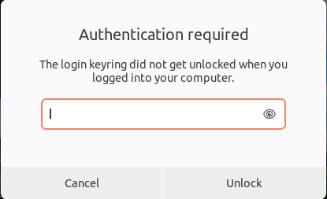

### Connecting to Github with HTTP or SSH Sessions

## Goals 

- Authenticate command line git to GitHub.

## Toolkit 

- Any Linux based computer with command line git.

## Process

1. Deploy the GitHub command line application and authenticate the local Linux/Unix account to the GitHub account.
```
sudo apt install -y gh
```

2. Setup authentication with the command line tool.

```
gh auth login
```

3. Follow the following prompts. Select GitHub.com (default choice)

```
? What account do you want to log into?  [Use arrows to move, type to filter]
> GitHub.com
  GitHub Enterprise Server
```

5. Select SSH (**NOT** default choice, use arrow keys to change)

```
? What is your preferred protocol for Git operations?  [Use arrows to move, type to filter]
> HTTPS
  SSH
```

8. When prompted select "Login with a web browser" option (default choice) regardless of the type of terminal these commands are being entered in.

```
? How would you like to authenticate GitHub CLI?  [Use arrows to move, type to filter]
>  Login with a web browser
   Paste an authentication token
```

9. The "open browser" prompt will only work in certain contexts. Press enter to open the local browser.  
```
The Enter to open github.com in your browser...  
```

10. If launching the browser produces the following error, enter the standard class password to proceed to the browser.



11. If the process doesn't present a web browser to login to github, browse to the following URL on any computer that is already logged into on GitHub: https://github.com/login/device  Enter the one-time code and select "Authorize github"

12. Follow the prompts to authorize this session to the OHIO-ECT repo, which may include additional login's to Ohio University's SSO.

13. Return to terminal window and press enter at "Authentication complete. Press Enter to continue..." to complete the authentication process.

14. In the gHost terminal configure Git user info with the following commands
```
git config --global user.email "<OHIO_EMAIL>"
git config --global user.name "<FIRSTNAME> <LASTNAME>"
```

15. The following test should produce the markdown text of the ECT Cheat sheet repo
```
gh repo view OHIO-ECT/Lab-Notebook-Cheat-Sheet
```
