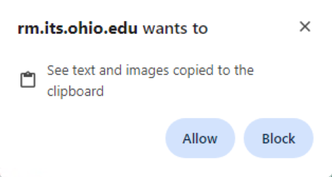
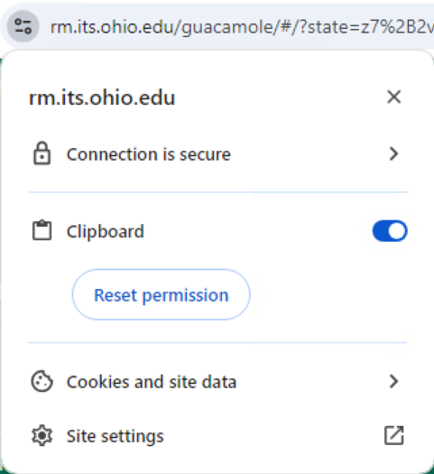
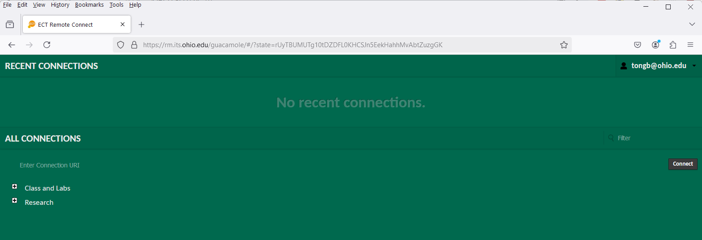
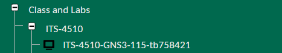
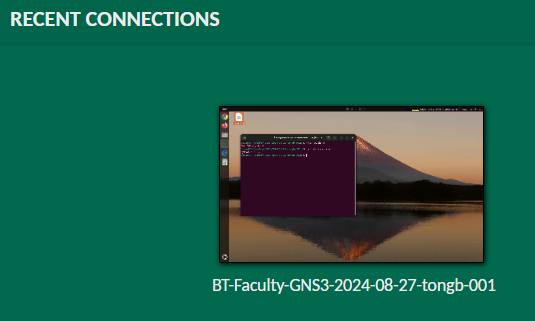
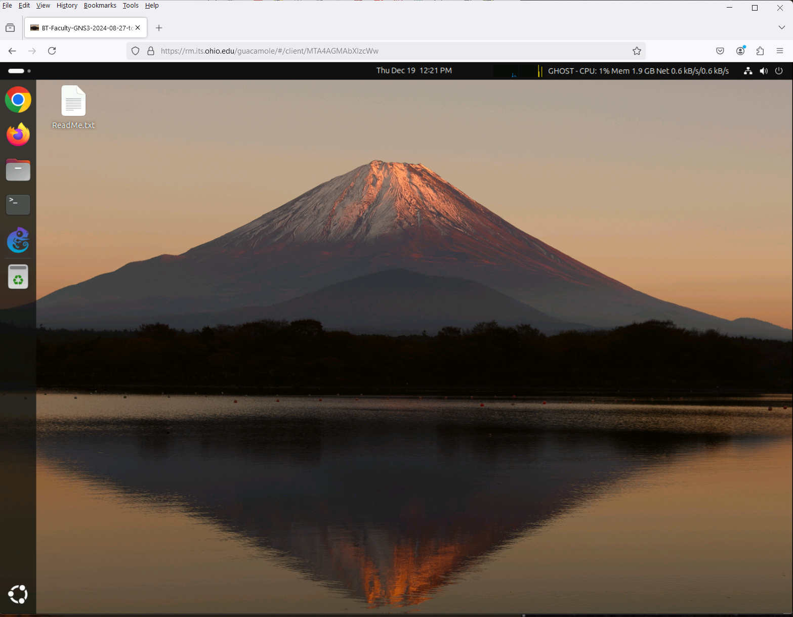
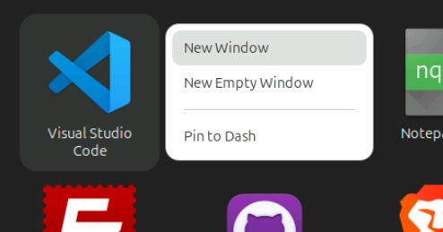
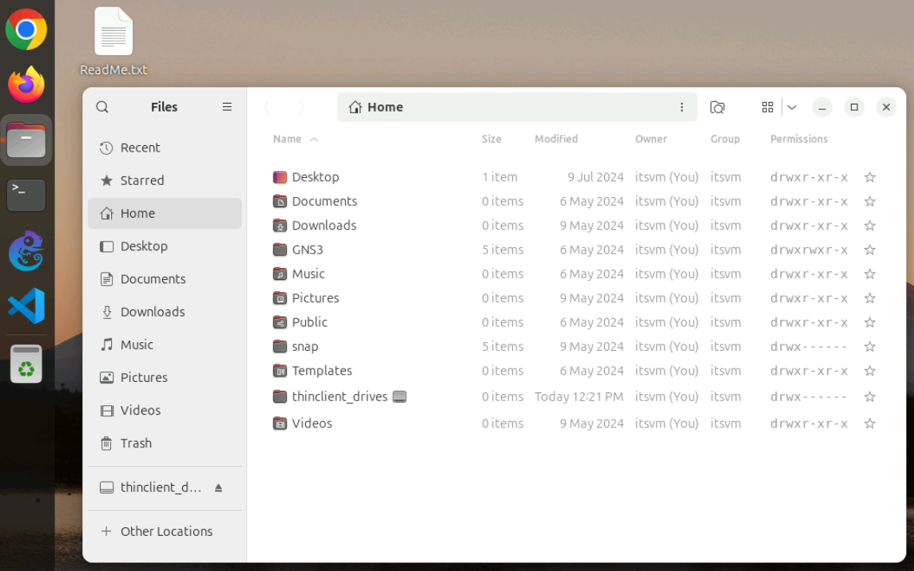
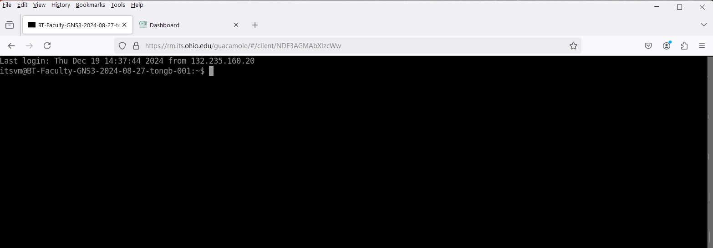

## Connect to a VM via a Web Browser and the Guacamole Service

### Goals
- Demonstrate how a student can connect to a Graphical User Interface of their virtual host via a web-based method.
- Demonstrate how a student can connect to a Command Line Interface of their virtual host via a web-based method.

### Pre-Lab
- Watch the the following [ECT Tech Nuggets](https://www.youtube.com/@ecttechnuggets9126/featured) videos on YouTube:
    - (Not available yet) [ECT Tech Nugget - N99.0 - Guacamole](https://youtu.be/)

### Resources

- Personal Computer (Desktop or Laptop) with a web browser, such as Chrome, Firefox, or Edge.
- Assigned gHost (GNS3 Virtual Machine)
- A document you have created to use as a lab notebook
- Tech Nuggets: [Tech Nuggets on YouTube](https://www.youtube.com/@ecttechnuggets9126)

### Connect to the Guacamole Service

Each student has been issued their own Linux Ubuntu Desktop Virtual Machine (VM). This system will be referred to as the "gHost" throughout the lab. The goal of this task is to show you how to connect to that environment so that you can work and complete assignments.

1. Retrieve the following information from either information presented in class, received via email, or perhaps found in canvas or other documentation related to the assignment. Ask faculty for assistance if needed.
 
    - GNS3 VM IP address
    - GNS3 VM Username
    - GNS3 VM Password

2. Watch the Pre-Lab video. **DO NOT follow along the first time.** Watch other Tech Nuggets as necessary to round out your understanding of related topics.

3. Connect to the Guacamole service from your own computer using your favorite browser. The URL is:
    - https://rm.its.ohio.edu/

    Bookmark that URL!

4. The first time a browser connects to the Guacamole service, a screen similar to the following will appear. Click on the "Allow" button to allow the Guacamole service to access your clipboard. This will allow you to copy and paste text between your personal computer and the VM. This feature will be required to work effectively with the remote machines.

     
    This is a one-time action. If you are using a different browser or a different computer, you will need to allow clipboard access again. If set correctly in the browser settings, you may not see this message again.
     
    Check status of this setting in your browser settings if you have trouble copying and pasting between your personal computer and the VM.
    

5. Login using your OHIO ID, Password, and your established method of Multifactor Authentication (MFA). Note: If you are already logged into some other University service, single sign-on features will reuse the credentials and session already established. 
     
    Once authenticated, you will see a screen similar to the following:

### Connect to your Virtual Machine's GUI via Guacamole
6. Locate and expand the "Class and Labs" caret (a little plus sign in a box) to reveal a list of the classes for which you have a VM.
 
It is possible to be in multiple classes each with their own VM. If so, it is important to use the correct VM for the correct class. Different classes may have gHost configurations for different classes. 
 

**TL;DR - Don't use an ITS-2801 VM for ITS-2300, and vice-versa, even if it does work.**

7. Note that if you have connected to Guacamole before the "Recent Connections" portion of the screen will present you with a quick way to reconnect as you had done before. You would just click on the connectio you desired. You won't see that the first time you connect, but it looks something like this:

8. Click on the line with the computer icon. This will login to your into your VM and lead to a GUI interface. **Be patient** with the connection as it may take a few seconds to establish. If the black login screen persists for more than 30 seconds, please contact your instructor.

    For now, avoid any lines with a >_ icon as that leads to a SSH Command Line interface (CLI).

### A Tour of the GUI

9. The toolbar on the left of the screen has a number of useful icons. If you mouse-over them you can see the names of the applications they will launch. Find each of the following:

- Google Chrome
- Firefox
- Files
- Terminal
- GNS3
- Trash
- Show Apps

    The last one is in the lower left corner, similar to where you might find the Windows icon (aka Start Button) on a Windows computer.

10. Some classes (ITS 2801) use the Visual Studio Code editor. If you are taking ITS 2801, click on the "Show Apps" icon. Find the "Visual Studio Code" icon, right-click on it, and choose "Pin to Dash" and it will be added to your toolbar. Once done, you can click on the "Show Apps" icon to make the list go away.

11. Launch the "Files" application from your toolbar by clicking on it. This is very similar to the Windows File Explorer or the Finder on the Macintosh. By default, it shows you the "Home" directory associated with your account. You can manage your files and directories (folders) using this application, though you can also do so via commands which is described in other Lab activities.

### Exfiltrating Data

12. The gHost machine has web access to the outside world. When saving data for lab reports there are several options. The easiest is to use a browser on the VM to access web-based email. Open the file named "README.txt" on the desktop, highlight the text found within, and copy it either by right-clicking on the highlighted text and choosing "copy" or via the CONTROL-C keys.

13. Back on your personal computer, open up any application that can receive text, such as Notepad or MS Word. Paste in the text that you copied from your VM. Notice that you can copy and paste from your VM to your personal computer, and vice-versa. You may find this to be handy in future assignments. You can close out the text application on your personal computer as we will not need it any more in this exercise.

14. Back on your VM, launch either the Chrome or Firefox browsers, login to your email service, compose a message to your OHIO ID, and attach the ReadMe.txt file to your message as an attachment. Send yourself the message. Then, on your personal computer, check your email and verify the attachment was included.

15. Back on your VM, point your browser to the Canvas LMS used by the class:
    - https://canvas.ohio.edu

16. Note that you can use the LMS as normal and that you could turn in assignments directly from your VM, if needed.

### Disconnecting from a VM

17. Information: To disconnect from your VM you would normally just close the browser window or tab. That would leave your VM in its current state so you could pick up where you left off when you returned. For this lab, we're going to do something else.

18. Use your browser's back button to return to the Guacamole Home screen. If in the step above you actually closed your browser window, then return to the URL and login again:
    - https://rm.its.ohio.edu

If you haven't already done so, you should bookmark that URL.

### Connect to your Virtual Machine's CLI

19. Locate and expand the "Class and Labs" caret to reveal a list of the classes for which you have a VM. Lower on the list of VMs for a specific class is another caret (plus sign) that you can expand to reveal SSH options. Click on that caret (plus sign). Each of your VMs will be listed with a >_ icon beside them.

20. Click on that entry. This will log you into your VM and lead to a command line interface.

### A Tour of the CLI

21. You are now at a Command Line interface to your VM. It is quite possible to develop applications in this environment, though you are more likely to do so in the GUI environment if you know your Linux commands.

You might be wondering why somebody might prefer to use a CLI. There are several reasons. First, professionally speaking, persons in certain specialties become very familiar with the available commands and can actually work faster in a command line environment. Secondly, computers running services that do not need a GUI can save a lot of resources by only offering a command line environment. Thirdly, when either a network or a host computer has lots of demand and is very busy a command line environment remains viable where a graphical environment becomes unusable.

In short, late in the semester when many classes are using the environment and some classes are doing some processor or I/O intensive operations, you may find the GUI to be laggy but the CLI to be fine. Keep your options open.

### Disconnect, Again

22. This series of steps is complete. Disconnect from your VM as the next task likely assumes you are not connected. If you don't remember how to disconnect, see one of the steps above.