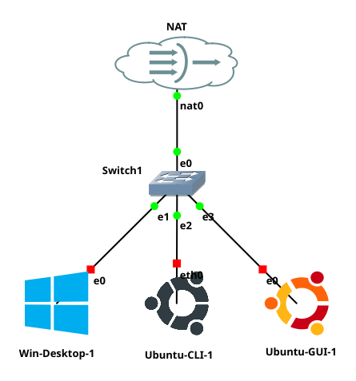

# GNS3 Projects

## Goals

- Learn to start a GNS3 Project

## Resources

- Personal Computer (Desktop or Laptop)
- Lab notebook document
- Assigned gHost (GNS3 Virtual Machine)
- [ECT/ITS Lab Notebook Cheatsheet](https://github.com/OHIO-ECT/Lab-Notebook-Cheat-Sheet)
- [ECT Tech Nuggets Playlist](https://www.youtube.com/playlist?list=PLEA5GnkCPRTlvN_eyR99jOSsBCaV6khRS)
- [GNS3 GUI Documentation](https://docs.gns3.com/docs/using-gns3/beginners/the-gns3-gui)

## Environmental Context

- Connection to gHost VM

## GNS3 Projects

1. Start the GNS3 application with gecko icon in the right hand navigation.

2. Use the "New Blank Project" button from the GNS3 toolbar. The interface that appears has two tabs. The first allows creating a new blank project and the second provides a list of projects from this computer "Project Library". Choose the project library and open the project "98 - Intro Lab".

3. If necessary, review [ECT Tech Nugget N1.1 GNS3](https://www.youtube.com/watch?v=w5qsM3LhpQI)

4. Expand the "All Devices" menu from the "Devices Toolbar" on the left hand side of GNS3.

5. Using the network diagram shown in this document connect all the GNS3 objects together. Review [ECT Tech Nugget N1.1 GNS3](https://www.youtube.com/watch?v=w5qsM3LhpQI) (scrub to about 6:20) for detailed instructions how to connect objects together in GNS3. 

6. Start all objects in the project with the big green triangle in the top tool bar. This action will start **ALL** the VMs at once. Get comfy as Atlas heaves the world up. The more objects in a project the longer this start up time will take. If Atlas is unfamiliar, there is time to read [this](https://greekgodsandgoddesses.net/gods/atlas) while all the GNS3 VMs (AKA child VMs) start up. Each child VM typically starts a console window so the status can be monitored. 
**Note:** It is not always necessary (or desired) to start all objects at once. If needed, Right-Click a specific child object and use its context menu to control it individually.

7. After starting up a project each GNS3 VM object will (typically) open a child console window. In this case should be three child windows inside the gHost.
- "Ubuntu-CLI-1", a Linux Server (terminal only)
- "Ubuntu-GUI-1", a Linux Desktop (GUI with terminal option)
- "Windows-Desktop-1", a Windows Desktop (GUI)  

8. For the non GUI machines it is possible to close the console and the GNS3 object will continue to operate. The console can be restored by right click on the object and selecting "Console".

9. Operating systems running inside operating systems (with windows inside windows) can be a very [Inception] idea. If this idea gives a headache, **it is being done correctly**. Much of what we do as IT Professional is virtual. This type of environment is a very good example. For some help with this idea see [ECT Tech Nugget - N34.0 - Technology Perspective](https://youtu.be/ixrzbdUu8yQ.)

10. Once all the GNS3 VMs have started and are either at a login prompt to a desktop GUI they are ready for use. Please record, in your lab notebook, that child VMs inside GNS3 typically use the username `itsclass` and the password `class115#`.

11. Projects remain running even if the user is NOT connected to the remote desktop connection. This allows the student to break from the lab work and return to the project later.

12. Shutting down GNS3 projects will be discussed on a separate page.
