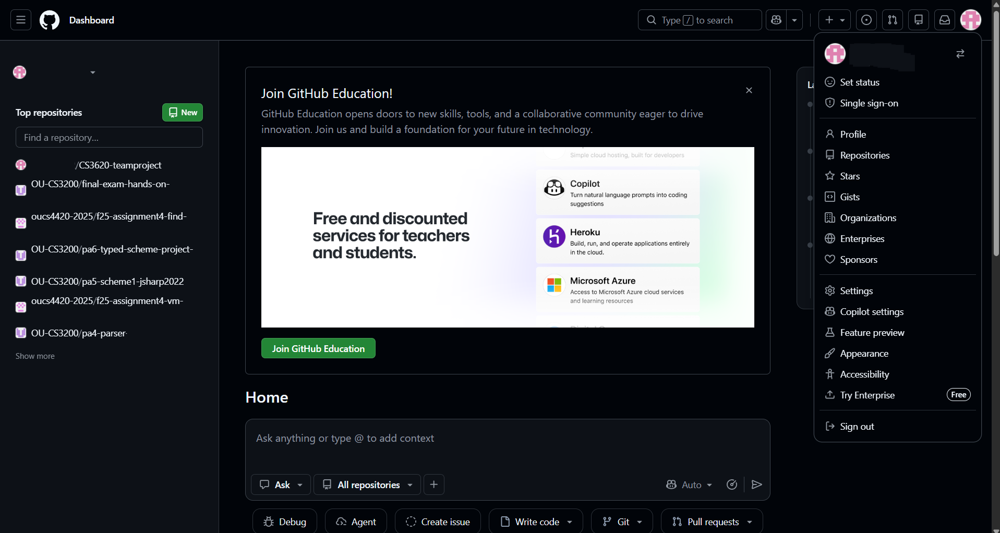
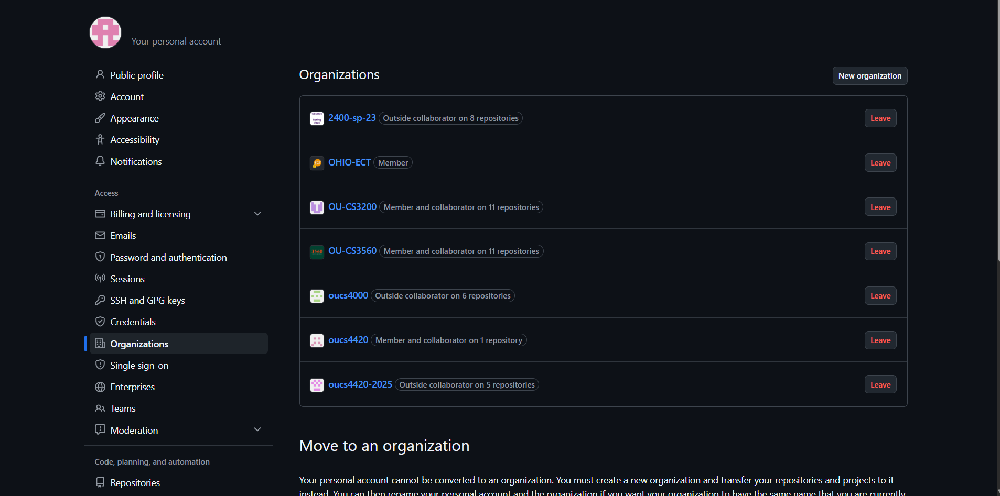

# GitHub Account Creation

## Goals

- A GitHub account with OHIO ID associated with it
- Email GitHub account info to course instructor(s)

## Resources

- Personal Computer (Desktop or Laptop)
- Lab notebook document

## Environmental Context

- Personal PC and a browser

## GitHub Web Site

1. The current web page being viewed is part of a *public* "github repo". However, **all other labs will *not* be public.** In a browser open up [https://github.com](https://github.com).
 

2. If you do not already have and account, create a GitHub account. Your OHIO email must be associated with the account to access the private repos. 
**Note:** Students with existing accounts will need to associate their OHIO email address with an existing account.
 

3. Send an email to the course instructors. The subject of the message needs to be the course number (i.e. ITS 2300). The body of the message should include the GitHub username (i.e. Github username: johnsmith)
 

4. Signed in at [https://github.com](https://github.com), open the Profile menu ▸ "Your profile". The browser address bar will show `https://github.com/<username>`. **Record that username in the lab notebook exactly as it appears in the URL.**
 

5. After the email is sent, the instructor will add the GitHub username to the OHIO-ECT organization, which generates an invitation. Once notified that this has been done, sign in at [https://github.com](https://github.com) and navigate to any GitHub page.
 

6. Click the profile picture in the upper-right corner of the page.
 

7. From the menu that opens, select "Organizations".

 

8. The browser will load the Organizations page.

 

9. Find the invitation from "OHIO-ECT" and accept it. Once accepted, OHIO-ECT is listed as a Member organization on this page.
 

10. Further labs/repos after this one cannot be accessed until the GitHub account is created, the information is emailed to the instructor, **and** the OHIO-ECT invitation is accepted.
   
## Lab Report Question(s)
The answers to these questions go into a quiz that's in the Learning Management System (LMS) for this course.
> **GitHub Account Creation:** What is the GitHub username recorded in step 4?