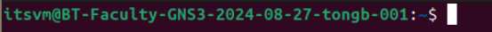

# Linux Fundamentals

## Goals
- Become familiar with the Linux Bash command line environments such as the Terminal and SSH.

## Resources
- Personal Computer (Desktop or Laptop)
- Assigned gHost (GNS3 Virtual Machine)
- Lab notebook document

## The Linux File Sytems and Related Commands

### Connect to Your VM

1. Connect to the VM's GUI using one of the approaches from previous tasks. If the process is unclear, refer to an earlier task. It should look similar to this:

 

2. Click on the "Files" icon on the Toolbar (left side of screen) to open up a view of the file system similar to what you might see on Windows or a Mac. The icon looks like a file folder.
 

3. Click on the "Terminal" icon on the Toolbar. The icon looks like a little black screen with a >_ on it. This will launch a command line environment (called a "command shell" or just "shell") where commands can be issued. After those two steps the screen should look something like this:

 

4. Make the Terminal window active.
 

### Command and Home Directory

5. Notice that there is a line like the following:

That line tells you a number of things:

| UserID | The first word up to the @ sign. (Example: itsvm) |
| Machine Name | After the @ sign up to the colon. (Example: ITS-2801-GNS3-110-xx999999) |
| Current Directory | In this example the current directory is tilde, which means your home directory. |
| Dollar Sign | Which mean you are a normal user. (Not an administrator.) |
| White Square | This is the cursor, just like you're used to having in a word processor. |
 

6. Press the RETURN or ENTER key on the computer. Notice how the shell just gives another prompt. No command was given, so it just reports that it is ready.
 

7. Type "pwd" and then press the RETURN or ENTER key. Notice two things. First, RETURN or ENTER had to be pressed to issue the command. The instructions will now stop telling to press RETURN or ENTER after each command, but it still needs to be done.

Second, the command produced a result. It said:

/home/itsvm

That's the path to the current directory. The command shell always issues its commands from the context of the current directory unless told otherwise. So, if told to open a file, it would look for the file in the current directory unless told to use a different directory.
 

### Listing Files (Looking Around)

8. Type the "ls" command. This time the results are a list of all files and directories in the current directory. If the name was shown in blue and/or with a "/" (slash) after it, then it is the name of a directory. If the name was in white and/or didn't have a slash after it, then it is the name of a file.
 

9. There are several aliases for the "ls" command that you may find useful.

| ls | List Files |
| l | List Files with a slash if directory |
| la | List All Files including hidden files |
| ll | Long List of All Files - Shows Details |
| ls -lF | Shows Files with Details |
 

### Changing Directories

10. Not all work is performed from the Home directory. The "cd" command can be used to change directories. For instance, from an earlier command there is a Desktop directory in the Home Directory. Issue these commands:

cd Desktop
pwd
ls

Notice after the "cd" command that the prompt changed to be "~/Desktop".

Notice the results of the "pwd" command were "/home/itsvm/Desktop". Those two observations go together. That is, the prompt is showing what directory is current and the tilde (~) means /home/itsvm, which is the home directory for the userid.

Finally, notice the ls command gave a new list of files and directories. Well, really just one file: ReadMe.txt. In fact, this file is already known. It is sitting on the GUI desktop. Yes, files that appear on the GUI desktop are those that are found in the Desktop directory.
 

11. The cd command can be used several ways.

| cd | Goes to the home directory. |
| cd _path_ | Goes to the directory specified by _path_ |

Issue the "cd" command with no other options. Notice the return to the Home directory. Type the "pwd" command to make sure.
 

12. The term Path has special meaning. It is an expression of a location on the file system indicating how to get to that location. There are two types of Path: relative and absolute.

A relative path is an expression of "how to get there from here" where an absolute path is an expression of "how to get there from the top of the file system." Most of the time you will use a relative path. You can tell the difference between the two because **an absolute path always starts with / (slash)**. Examples:

| cd Desktop | Go from the current directory into the Desktop directory below the current directory |
| cd .. | Go up one directory from the current directory |
| cd . | Go to the current directory (go nowhere) |

It might seem silly to say "cd ." (go nowhere) but there are other commands where paths are used and "." is a way to refer to the current directory. Similarly "~" (tilde) is a way to refer to the home directory. Yes, that means "cd ~" is another way to go to the home directory.
 

13. Switch to the "Files" application. Using this GUI tool, the file system can be viewed in a more familiar way. Notice that is has the exact same functionality as the commands that have been used. Anything possible in the Terminal with commands can be done in the Files application. In fact, **more** can be done in the Terminal window than in the Files application.
 

### Making and Removing Directories

14. Back in the Terminal, run the following commands:

cd
mkdir test

Notice that a directory named "test" was created. You should also see that directory appear in the Files application.

Now try the following command:

rmdir test

Notice the directory has been removed. This is only possible because the directory was empty. If there had been files in that directory you would have received an error. You should also have seen the directory get removed in the Files application.
 

### Linux text editor

Sometimes a quick text file edit is needed. In that case there is a basic editor available called Nano.

15. Type "cd" to return to the Home directory.
 

16. Type "nano myfile" to start the text editor. Since the file "myfile" did not exist, a new file will be created. If the file already existed then it could be changed. Type a few lines into the text file.
 

17. Notice at the bottom of the nano window there are commands. The carot symbol (^) refers to the CONTROL key, so to issue the Exit command hold down the CONTROL key and press X. (CONTROL-X) The nano editor will prompt to save the file buffer. If nano was entered without specifying a file name, then it would have asked for one at that point.

18. The command prompt should return. Files can also be viewed from the command line with the "cat" command. (Yes, that's a weird name for a command. There's history there which we won't go into. Trust that it makes sense in some way.) Use the command "cat myfile" to show the content of the file that was just created.
 

19. If desired, switch to the Files application and double-click on myfile. It should launch a program to show the contents of that file. Yes, myfile is being shown in a GUI text editor that may be more appealing than nano, but that GUI text editor is not available on all Linux systems, so nano (or pico, vi, vim) are better to know as they are more common.

20. Exit the GUI text editor. Return to the Terminal application. Issue the following command:

rm myfile

This removes (or deletes) the file. Notice that a file removed in this way does **not** show up in the Trash and cannot be recovered.

### Final Thoughts

At this point there might be wondering "why don't we do everything in the GUI?"

The reality is not everything can be done in a GUI. As technologists who configure, integrate, and develop, there will be work in environments that only have fundamental support via a command line. Plainly stated, a GUI is a convenience that is not always available and a GUI usually doesn't have as many options as a command line has available.

What needs to be accomplished using the command line depends on the class being taken. If configuring networks, configuring cybersecurity services, or writing programs, the command line may be needed to accomplish tasks. This is real experience relative to real jobs.
