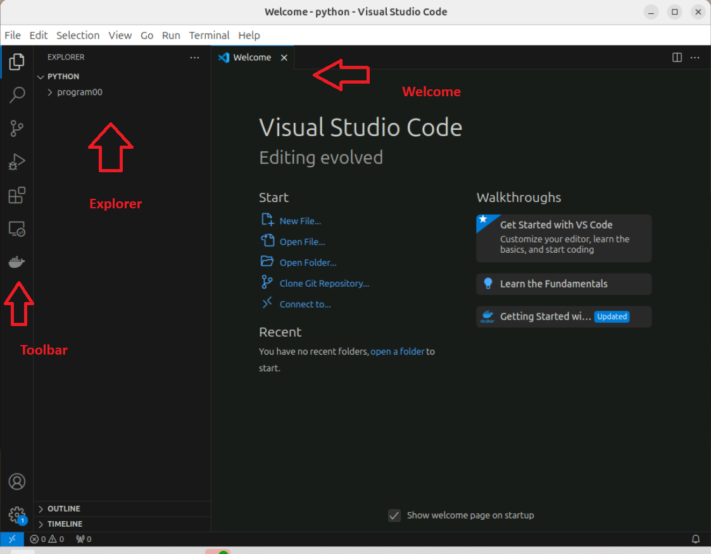
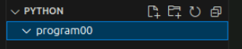
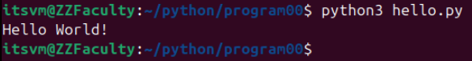
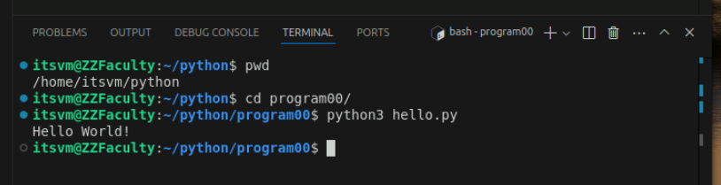
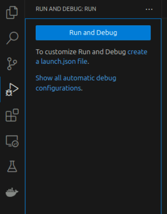

# Develop a Basic Python Script

Stated plainly, a python script is a series of python command placed in a text file which is then executed by the Python interpreter. So, in order to develop a python script, you must type your commands into a text file. By convention, we name these scripts with a ".py" extension. Thus, a file named "hello.py" is a python script.

Any text editor can be used to write a script. You could use Notepad on your Windows computer or nano on a Linux computer. You could even use MS Word and save the program as a text file. But programmers tend to use text editors that are specially designed to be used for programming because those editors come with more features. This task will walk you through using the VS Code editor.

## Objectives

- Demonstrate how to use the VS Code Editor
- Develop a basic program that will prove the Development Environment is functional.
- Run the basic program and observe the results.
- Exfiltrate your program so you can turn it in as part of your assignment.

## Tasks

### Login to your VM

1. Login to your VM as has been described in previous tasks.
<br>

2. Launch the Terminal application. It might still be running from a previous task.
<br>

3. Launch the Files application if you want to, but it is not required. It might also still be running from a previous task.
<br>

### Create a python Directory

4. In the Terminal application, make sure your current directory is your Home Directory. Remember that you can use the "cd" command with no other options to return to your Home Directory.

```
cd
```
<br>

5. Make a directory named "python". This will make a single place to collect all of your python programs.

```
mkdir python
```
<br>

### Create an assignment-01 Directory

6. Change to your python directory.

```
cd python
```
<br>

7. Make a directory for this assignment called "program00".

```
mkdir program00
```
<br>

8. Change to your program00 directory.

```
cd progam00
```
<br>

9. If you have the Files application running, you should see those new directories have been created. The next steps are going to use another program that will need space on your screen. Leave the Files application running if it provides you some comfort, but you don't need it. You could always launch it again if you wanted it.
<br>

### Launch VS Code

VS Code (Visual Studio Code) is a popular text editor used by programmers. It understands the syntax of programming languages. This lets it provide syntax coloring and hints that might save you time. Visual Code wants to work on a project and it will think of directory as the location of this project. You can either specify that directory when you launch VS Code, or tell VS Code which directory to use after you have launched it. By default, VS Code appears to detect the python directory that you have created.
<br>

10. Launch VS Code via either of these methods:

- Type this command: "code" in your Terminal window.
- Click on the "Visual Studio Code" icon that you've added to your Toolbar.
- Click on the "Show Apps" icon in the lower left corner of the GUI and then choose "Visual Studio Code."
<br>

11. When asked if you "trust the authors of the files in your python folder", choose **Yes, I trust the authors**.
<br>

12. Take a few minutes to become familiar with the layout of the screen.
<br>

- On the left is a toolbar with icons such as "Explorer", "Search", "Source Control", "Run and Debug", "Extensions", "Remote Explorer", and "Docker."
- The "Explorer" icon is a little brighter indicating it is selected, which is why there is an "Explorer" pane on the left side showing your python and program00 folders.
- The "Welcome" pane on the right tells you of some basic functions. As you open files to edit they will also appear on the right.


<br>

### Enter the Hello World Program

13. In the Explorer pane, click on "program00" and it should become highlighted.
<br>

14. Click on the "New File" icon, name the file hello.py, and hit RETURN. This will both create the new file and open a pane on the right side of VSCode. If you cannot find the "New File" button, it is in the upper right of the Explorer pane as shown here:


<br>

15. At the bottom of your VSCode screen you may see an alert asking if you want to install the recommended 'Python' extension. **Yes, install the Python language extension.** This will change your view to the "Extensions" pane on the left, and open a new pane on the right. There will be a progress bar above the Extensions pane. Let it finish. Once it is complete, you can close the "Extension: Python" pane on the right and on the left, return to the "hello.py" pane on the right, and you can return to the "Explorer" pane on the left.
<br>

16. In the "hello.py" pane, enter the following:

```
print( "Hello World!" )
```

Every letter matters so you have to be exact. Notice that VSCode will try to offer helpful advice. At this point that advice is probably more intrusive than helpful, but it will become more useful the more you know.
<br>

17. Notice there is a white dot beside your hello.py name at the top of the right pane. This is an indicator that you have made changes to the file that have not been saved. There are two ways to save your work. Pick one:

- On the VSCode Menu, select File > Save
- The the shortcut keys: CONTROL-S

At this point you have a program that is ready to be tested.
<br>

### Run the Hello World Program

18. Switch to the Terminal window.
<br>

19. Make sure you are in the program00 folder:

```
pwd
```

It should read "/home/itsvm/python/program00" and if you use the "ls" command you should see "hello.py" is present. If not, then you either need to use the "cd" command to get to the right directory, or you have made a mistake using VSCode and put your "hello.py" file in some other location.
<br>

20. Run your program:

```
python3 hello.py
```

It should result in something like this:



Note that it printed "Hello World!" to your terminal. Your program ran, printed, and exited leaving you at another prompt.
<br>

21. At the risk of confusing you, let look at another VSCode feature. The VSCode developers know that programmers often use a terminal to run their programs so there is a terminal feature built into VSCode. Open a terminal **within** VSCode via the menus at the top of the window:

- Terminal > New Terminal

This will open up a terminal session in a pane at the bottom of your VSCode window. It acts just like a real terminal (because it is a real terminal.) If you like the terminal window in VSCode, then leave that pane open. If you prefer to have more screen space for working on programs, then close it and use the Terminal application. It is a matter of personal preference.


<br>

22. Another way to run your program is the "Run and Debug" pane that you can select on the far left as an alternative to the "Explorer" pane. When selected, it looks like this:


<br>

23. Click on the "Run and Debug" button. It will likely ask you which debugger to use. **Choose the Python Debugger.** It will followup with another question "Select a debug configuration." **Choose Python File** from the list. Since it the first time you have used this feature it will need time to download and install that feature.

Notice that this feature opens a Terminal pane for you if you didn't have one open. Then it issues the commands to run your program. It uses a lot more options when it runs your program so that it could provide debugging features if needed.

The use of a debugger is a topic best left for later as it assumes you know more about Python. We recommend using one of the terminal options to run your program until such time as you learn more about debugging features. It is mentioned here because you were likely to discover the option as you become familiar with VSCode.
<br>

### Exfiltrate the Hello World Program

24. Launch a browser on your VM (Chrome or Firefox) and use it to either send your hello.py file to yourself via email or to upload it to canvas, depending on the class you are taking.
