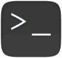

# Terminal Shell and File Management

## Goals

- Become familiar with the Linux Bash command line terminals (CLIs)
- Understand the relationship between terminal file systems and graphical file systems

## Resources

- Personal Computer (Desktop or Laptop)
- A document you have created to use as a lab notebook
- Assigned gHost (GNS3 Virtual Machine)
- [ECT/ITS Lab Notebook Cheatsheet](https://github.com/OHIO-ECT/Lab-Notebook-Cheat-Sheet)
- [Linux Command Reference](Linux-Command-Reference.md)

## Environmental Context

- Connection to gHost VM
- Running "98 - Intro Lab" GNS3 project (see Task GNS3 Projects)
- Child VMs are started and ready for use

## Toolkit

- Shells (i.e. Powershell, Bash)

## Terminal Shell and File Management

1. Open the Ubuntu-GUI object and start a terminal with the black ">_" icon.
 The runs a program called a shell. The terms terminal and shell are often used interchangeable.<br>
 

2. Terminals take text commands and typically offer text based responses. The shell provides a prompt that should look something like ``itsclass@its-ud-xx:~$`` Terminals will be used in the administration of many of the computer and networking systems in real and virtual environments. In addition to running programs, terminals are often an interface to the files that make up the object.
<br>

3. Run the command ``pwd`` to get the Current Working Directory (CWD) of the terminal session. This will return the string ``/home/itsclass`` which is this users Home directory.
<br>

4. Use the command ``ls`` to list the files in this terminals current working directory.

5. Select the "Files" application from the Ubuntu-GUI menu. By default this will open to the same Home directory and show graphical representations of the same directory as seen in the ``ls`` output. 
<br>

6. In the terminal, run the Command ``mkdir test`` and then issue the command ``cd test``, to create a new directory and change the CWD for the terminal to that new directory. Note the change in the prompt to be ``itsclass@its-ud-xx:~/test$`` In many linux terminals the home directory the shortcut ``~``. This prompt is configurable and non-standardized but most linux distributions include the CWD in the terminal prompt.

7. The folder ``test`` also appears in the Files GUI now. This demonstrates that both the terminal and the graphical file manager are viewing the same underlying file system.

8. Open a second terminal and note current working directory starts at the home directory again. The development of even simple networks can lead to a multitude of open terminals. Maintaining the perspective of where one is working will minimize mistakes in both academic labs and real life systems.
<br>

9. Use the ``cd`` and ``ls`` commands to explore two or three directories (aka folders) in the file system of the Ubuntu-GUI.
<br>

## Hostnames and sudo

10. Computers are typically given hostnames which help the administrator maintain the perspective of what computer they are issuing commands to. Including those in the terminal. The objects in GNS3 are all given a generic name. Use the ``hostname`` command to see this name and note that is also a part of the default shell prompt. Issue the following command to update the hostname of the GUI.

```
sudo nmcli general hostname lab98-ubuntu-gui
```
<br>

11. The ``sudo`` prefix causes the program to run with administrative privileges. USE significant caution when using the ``sudo`` command.
<br>

12. This hostname command is available in the lab notebook cheatsheet, but should also be maintained in a digital lab notebook.
<br>

13. Use the ``exit`` command to close the shell and start a new shell to refresh the hostname.
<br>

## Linux text editor

14. Use ``cd test`` to return to the test directory.
<br>

15. Type ```nano``` to start the text editor. Type several sentences into the text file.
<br>

16. Issue the command ``<ctrl>-x`` to nano to exit the program. When prompted enter ``y`` to save the file buffer, and hit enter to accept the file.txt filename.

17. The command prompt should return. Files can also be viewed from the command line with the ``cat`` program. Use the command ``cat file.txt`` to show the content of the file that was just created.
<br>

18. Return to the Files GUI and browse to the test directory and double click on the file.txt file to open the file in the GUI text editor.

## Windows PowerShell

19. Microsoft has a set of terminal applications. The current terminal is called "PowerShell". Microsoft uses a different set of commands, but also have aliases to simplify operations for people with Linux experience. The relationships between files in the terminal and the GUI are similar.
