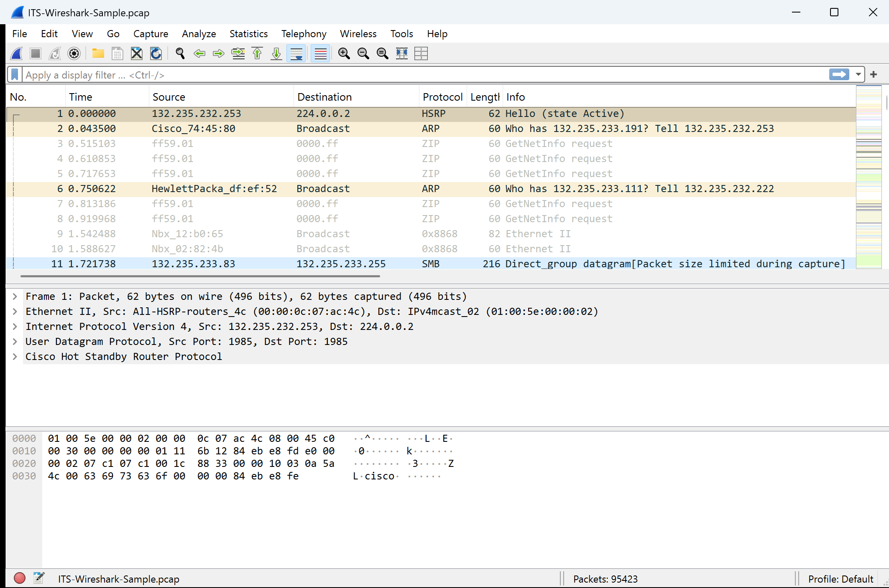

# Wireshark

## Goals

- Learn to use Wireshark to packet sniff network traffic
- Use Wireshark filters to search specific types or qualities of traffic

## Pre-Lab

- Watch the following [ECT Tech Nuggets](https://www.youtube.com/@ecttechnuggets9126/featured) videos on YouTube:
  - [ECT Tech Nugget N0.5 Basic Diagnostic Tools 5](https://youtu.be/QTIbS9wyfag)

## Resources

- Personal Computer (Desktop or Laptop)
- A document you have created to use as a lab notebook
- Assigned gHost (GNS3 Virtual Machine)
- [ECT/ITS Lab Notebook Cheatsheet](https://github.com/OHIO-ECT/Lab-Notebook-Cheat-Sheet)

## Environmental Context

- Connection to gHost VM
- Running "98 - Intro Lab" GNS3 project
- Child VMs are started and ready for use

## Wireshark Packet Sniffer

Wireshark is a packet capture tool available on Linux, Mac, and Windows for free. See [ECT Tech Nugget N0.5 Basic Diag Tools 5 Wireshark](https://youtu.be/QTIbS9wyfag) for more details about Wireshark. Wireshark may be used in several contexts within the student's ecosystem. Including on the student's Personal Computer, within GNS3, and with GNS3 objects.

1. On your gHost, start Wireshark by clicking on the "Wireshark" icon on the desktop or by using the application menu to find and start Wireshark.

2. Wireshark can save/load packet dump files from an industry-standard ``.pcap`` format for later processing. Students will regularly capture data on their gHost to be processed later. Download [ITS-Wireshark-Sample.pcap](../files/ITS-Wireshark-Sample.pcap) to your gHost's desktop by clicking on the link, and select download using the "raw" option.

3. Start Wireshark and open the "ITS-Wireshark-Sample.pcap" file using File/Open options. **Note:** Wireshark may not start by double-clicking a capture file. 

4. Once the file is loaded, Wireshark will display three panes:
    - Top pane: Summary lines for each packet captured
    - Middle pane: Detailed breakdown of the selected packet
    - Bottom pane: Raw hexadecimal and ASCII representation of the selected packet 
    

5. Observe the summary lines in the top frame of Wireshark. To select a packet, click anywhere on the summary line.
   
## Wireshark Filtering and Exporting
1. Scroll down to packet 58. This machine is trying to match the IP address 132.235.233.254 to the corresponding Ethernet (MAC) address using the ARP protocol. The next packet (59) contains the answer, right on the summary line in the top Wireshark window.

2. Rather than searching through the raw data, display filters are used to help find types of packets. Just above the summary Pane is Display Filter entry for: `Apply a display filter ... <Ctrl-/>` text box.
    - In the filter window, use the filter ``ip.addr==132.235.232.204`` to show only packets to or from the IP address.
    - The field should turn **green** showing that this is a valid filter (Red means invalid, yellow means incomplete).
    - Press Enter to apply filter. To reset the view, use the "X" button on the far right of the filter line.

3. In the filtered view, look for a packet with `Echo (ping) Request`.

4. Use the `View` menu and select `Expand All`. Notice that the middle frame expands the packet data to show **a lot** of detail.

5. To export packet details for use in a lab report, use: needed into a format where portions of it can be used in a lab report. First stop the capture then use: `File -> Export Packet Dissections -> As Plain Text...`

6.  A Wireshark Save dialog window will open with several choices along the bottom. 
    - In the lower left, called `Packet Range` change the radio button to `Selected packet`
    - In the lower right, called `Packet Format` make sure the `Packet summary line`,`Include column headings` and `Packet details: As Displayed` options are checked (checked by default)

7.  Select a location and name for the file. Pressing the Save button will create a **TEXT** file for use in a lab report. The packet text output may need some formatting before using it in an assignment.

8.  For more details about how to export data for lab reports see [ECT Wireshark Export Guide](https://github.com/OHIO-ECT/Wireshark-Export-Guide). Close Wireshark when done.

## GNS3 Wireshark - Live Packet Capture!

Wireshark can sniff packets on GNS3 project links, which is helpful for diagnosing issues. See [ECT Tech Nugget - N1.1 - GNS3](https://youtu.be/w5qsM3LhpQI) (9:49) for a demo. To start a capture, right-click on a link between two objects (the link turns red when selected) and choose "Start Capture". This starts both the capture program and Wireshark. **Important:** Closing Wireshark does **not** stop the capture program (indicated by a magnifying glass icon on the link). The capture will continue running and eventually crash the gHost due to memory exhaustion. Always right-click the link and select "Stop Capture" when finished.

13. In the GNS3 project, right-click on the link between the Ubuntu-GUI-1 and the switch. In the context menu, select `Start Capture` and press OK on the pop-up dialog box to begin packet capture (AKA packet sniffing). Wireshark GUI will auto-start and begin showing packet data for traffic going to or from the Ubuntu-GUI-1 object. A small magnifying glass icon will appear in GNS3 on the link.

14. In Wireshark, use the following display filter: `ip.addr==X.X.X.X`. Make sure to replace `X.X.X.X` with the IP for the Ubuntu-GUI-1 that was discovered earlier. This filter displays traffic going **to or from** the specified IP (Ubuntu-GUI-1 in this case).

15. On Ubuntu-GUI-1, open a terminal window and `ping 8.8.8.8`. Allow it to run for five ping iterations and use CTRL+C to stop ping.

16. Go back to Wireshark and find those five ping packets (there should also be five responses).

17. Stop the capture process (not Wireshark). Right-click on the link with the magnifying glass, in the context menu select `Stop Capture`. This will stop **new** packets from showing up in Wireshark.

18. On the filter line in Wireshark, add the following to the end after the current filter `&& icmp`. The complete filter will be:

    ``ip.addr==X.X.X.X && icmp``

    This filters the results even further to show only packets from the specified IP **and** packets that are ICMP (ping packets in this case).
