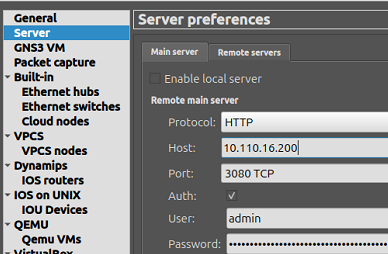

# WARNING - DO NOT THIS TASK UNLESS YOU ARE EXPLICTLY DIRECTED TO.
Failure to heed that warning will open your GNS3 to unauthenticated access and plausible distruction.

# The gHost that will serve as the GNS3 server with the shared project.

1. Gracefully save configurations and shutdown any project that is running in GNS3.

2. Shutdown GNS3 and restart it and select "cancel" in the open project dialog.  DO NOT open a project.

3. Select the Edit -> Preferenced Menu and select "Server" from the left hand navigation

4. Change the "Host binding" from `localhost` to `0.0.0.0`.

# On each gHost that will serve as a client. 

5. Un-check "Enable local server"

6. Enter the internal IP address of the gHost that will function as the server.

7. Save the configuration.

8. Close and reopen GNS3.

9. The open projects dialog should show the projects from the "server" gHost.

# Loading local projects again
To reopen projects on each client gHost.  

1. Select the Edit -> Preferenced Menu and select "Server" from the left hand navigation

2. Check "Enable local server"

3. Save the configuration.

4. Close and reopen GNS3.
